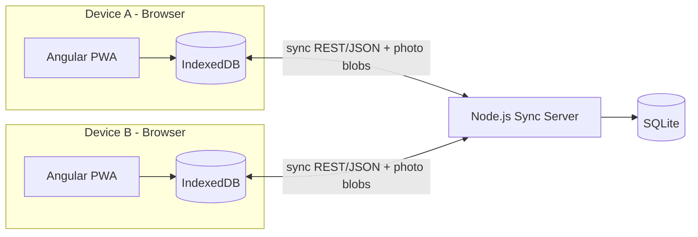
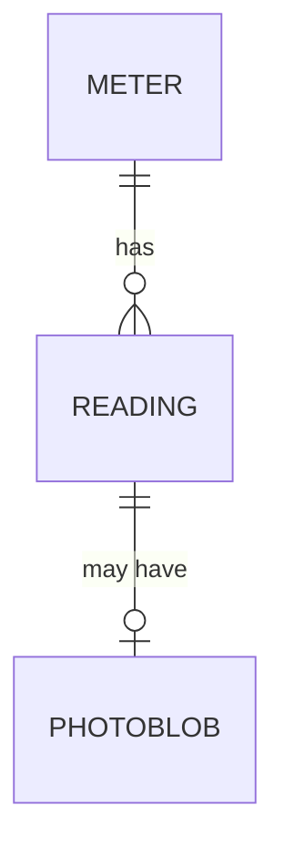

# Home Meter Tracker - Product Overview (PRD 00)

## 1. Vision

A simple, private, offline-first web app that lets a single household track utility
meter readings (electricity and water) over time, understand consumption trends, and
keep the data safe and available across the user's own devices.

The app must be usable while standing at the physical meter with a phone, work fully
offline, and later sync to a self-hosted server for backup and multi-device access.

## 2. Goals

- Record cumulative meter readings quickly and correctly.
- Automatically compute consumption (usage) between readings.
- Visualize usage over time and compare periods.
- Work 100% offline; never lose data.
- Sync across the user's devices and act as a backup, via a self-hosted server.

## 3. Non-Goals (whole product)

- No cost / tariff / money tracking (kWh and m3 only).
- No reminders or scheduled notifications.
- No multi-user accounts or sharing (single user only).
- No automatic meter reading (no smart meters, OCR, IoT, or API imports).
- No public/cloud multi-tenant hosting; server is for the user's private network.

## 4. Personas

- **The Homeowner (primary and only user)**
  - Reads physical meters manually and types the totals.
  - Wants to see if consumption is going up or down.
  - Not technical about data; wants it to "just work" and never lose entries.
  - Uses a phone at the meter and occasionally a laptop for review.

## 5. Glossary

- **Meter**: A physical device measuring a utility (e.g. "Garage electricity").
- **Reading**: A single recorded meter value at a point in time (cumulative total).
- **Cumulative value**: The absolute number shown on the meter (an ever-increasing total).
- **Usage / Consumption**: Derived difference between two consecutive readings of the same meter.
- **Period**: A time window used for aggregation (day, week, month, year).
- **Soft delete**: Marking a record as deleted (via `deletedAt`) instead of removing it, so deletions can sync.
- **Sync**: Reconciling local device data with the server (Phase 2).

## 6. Tech Stack

### Frontend (Phase 1 and 2)
- **Angular** (latest stable), standalone components, Angular Router.
- **Angular Signals** for reactive state.
- **PWA**: `@angular/pwa` with the built-in service worker for offline + installability.
- **Local storage**: IndexedDB, accessed via a thin wrapper (recommended: **Dexie**).
- **Charts**: a charting library (recommended: **Chart.js** via `ng2-charts`, or **ngx-charts**).

### Backend (Phase 2 only)
- **Node.js** with **Express**.
- **SQLite** for storage (single file).
- **Docker** + `docker-compose` for deployment.
- **No authentication** (home network only) - see Phase 2 for the security note.

## 7. Target Architecture (end state after Phase 2)

In Phase 1 there is no server: the app is only the left/right browser boxes with
their local IndexedDB. Phase 2 adds the server and the sync arrows.

## 8. Shared Data Model

This model is the contract used by both the Phase 1 local store and the Phase 2 server.
All ids are client-generated UUIDs (v4) so records can be created offline without a
server round-trip and merged during sync.

### 8.1 Entities

**Meter**

| Field         | Type                         | Notes                                              |
|---------------|------------------------------|----------------------------------------------------|
| id            | string (UUID)                | Primary key, client-generated                      |
| name          | string                       | Required, e.g. "Garage electricity"                |
| type          | enum `electricity` \| `water`| Required                                           |
| unit          | string                       | Derived from type: `kWh` for electricity, `m3` for water |
| location      | string                       | Optional, e.g. "Basement"                          |
| serialNumber  | string                       | Optional                                           |
| notes         | string                       | Optional free text                                 |
| createdAt     | string (ISO 8601)            | Set on creation                                    |
| updatedAt     | string (ISO 8601)            | Updated on every change (used for sync)            |
| deletedAt     | string (ISO 8601) \| null    | Soft-delete marker                                 |

**Reading**

| Field     | Type                      | Notes                                                        |
|-----------|---------------------------|-------------------------------------------------------------|
| id        | string (UUID)             | Primary key, client-generated                               |
| meterId   | string (UUID)             | FK -> Meter.id                                              |
| value     | number                    | The cumulative total read from the meter                    |
| readAt    | string (ISO 8601)         | When the reading was taken (user-editable, defaults to now) |
| note      | string                    | Optional free text                                          |
| photoId   | string (UUID) \| null     | Optional FK -> PhotoBlob.id                                 |
| createdAt | string (ISO 8601)         | Set on creation                                             |
| updatedAt | string (ISO 8601)         | Updated on every change (used for sync)                     |
| deletedAt | string (ISO 8601) \| null | Soft-delete marker                                          |

**PhotoBlob**

| Field     | Type              | Notes                                            |
|-----------|-------------------|--------------------------------------------------|
| id        | string (UUID)     | Primary key, client-generated                    |
| readingId | string (UUID)     | FK -> Reading.id                                 |
| mimeType  | string            | e.g. `image/jpeg`                                |
| data      | Blob / binary     | Image bytes (stored in IndexedDB; BLOB in SQLite)|
| createdAt | string (ISO 8601) | Set on creation                                  |

### 8.2 Sync metadata rules
- Every syncable record (Meter, Reading) carries `updatedAt` and `deletedAt`.
- Deletions are soft: set `deletedAt` and bump `updatedAt`; the record still syncs.
- `PhotoBlob` is immutable once created (no edit); it is deleted only when its reading is hard-cleaned (out of scope) - on soft delete of a reading the photo stays.

### 8.3 Derived values (never stored)
- **Usage between readings**: for readings of the same meter ordered by `readAt`,
  `usage(n) = value(n) - value(n-1)`.
- **Per-day average**: `usage / days between the two readings`.
- **Period totals** (week/month/year): sum of usage attributed to the period.
  - Recommended attribution: distribute a reading interval's usage evenly across the
    days it spans, then aggregate by period. Document the chosen method in Phase 1.

### 8.4 Entity relationships

## 9. Phase Roadmap

| Phase | Deliverable | Depends on | Doc |
|-------|-------------|------------|-----|
| 1 | Offline-only Angular PWA, all features, IndexedDB storage. Shippable MVP. | - | `01-phase-1-mvp-local-app.md` |
| 2 | Node.js + SQLite + Docker sync server and the Angular sync engine. | Phase 1 | `02-phase-2-sync-and-server.md` |

Phase 1 must be fully functional and usable on its own before Phase 2 begins. Phase 2
adds sync without changing the Phase 1 user experience.

## 10. Cross-cutting requirements

- **Data safety**: no operation should silently lose readings; deletes are soft and reversible until a future cleanup feature (out of scope).
- **Offline-first**: all core flows (add/edit/delete meters and readings, view charts) work with no network.
- **Privacy**: data stays on the user's devices and their own server; no third-party services.
- **Performance target**: smooth with up to ~10 meters and ~10 years of monthly readings (a few thousand records) plus photos.
