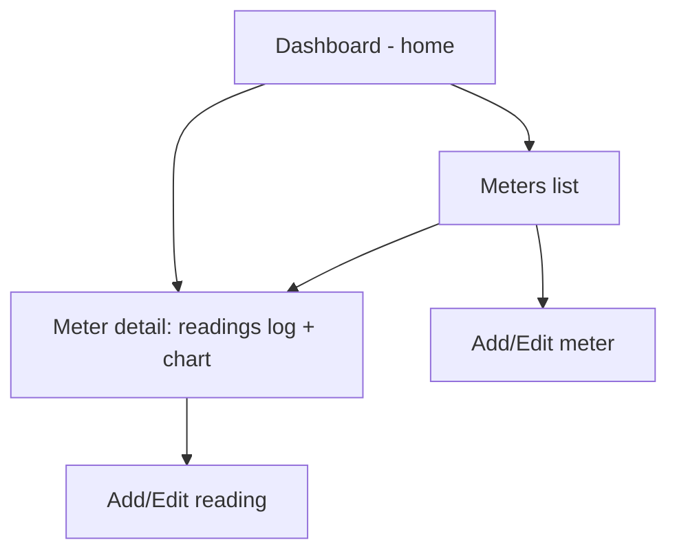

# Phase 1 - Offline-Only Local App (PRD 01)

> Read `00-overview.md` first for the shared data model, glossary, and tech stack.

## 1. Objective

Deliver a complete, shippable Angular PWA that lets the homeowner manage meters and
record readings entirely offline, with dashboards, charts, comparisons, totals, and a
per-meter history log. All data lives in the browser (IndexedDB). No server, no network.

## 2. Scope

### In scope
- Meter management (create, read, update, soft delete).
- Reading management (create, edit, soft delete) with cumulative-value model.
- Low-reading validation warning.
- Optional photo per reading, stored locally.
- Dashboard homepage, usage charts, period comparisons, summary totals, log table.
- Offline support and PWA installability.

### Out of scope (Phase 1)
- Any networking or sync (added in Phase 2).
- Auth, accounts, cost tracking, reminders, import/export.

## 3. Tech requirements

- Angular latest stable, standalone components, Angular Router, Angular Signals.
- `@angular/pwa` service worker configured for offline app-shell caching.
- IndexedDB via **Dexie** (recommended). Define a versioned schema matching the data model.
- Chart library: **Chart.js** via `ng2-charts` (recommended) or `ngx-charts`.
- All ids generated client-side with `crypto.randomUUID()`.
- Timestamps stored as ISO 8601 strings (UTC).
- The data-access layer must be a dedicated service (e.g. `LocalStore`) so Phase 2 can
  layer sync on top without touching UI components.

## 4. Information architecture / navigation

Routes (suggested):
- `/` Dashboard
- `/meters` Meters list
- `/meters/new`, `/meters/:id/edit` Meter form
- `/meters/:id` Meter detail (log + chart + comparisons)
- `/meters/:id/readings/new`, `/readings/:id/edit` Reading form

## 5. Features, user stories, and acceptance criteria

### 5.1 Meter management

**User stories**
- As the homeowner, I can add a meter with a name, type (electricity/water), location,
  serial number, and notes, so I can track multiple meters.
- I can edit a meter's details.
- I can delete a meter I no longer use.

**Functional requirements**
- Type selection is electricity or water; `unit` is auto-set (`kWh` / `m3`) and read-only.
- Name is required; other fields optional.
- Delete is a soft delete (`deletedAt` set); soft-deleted meters disappear from all lists
  and dashboards.

**Acceptance criteria**
- [ ] Creating a meter persists it to IndexedDB and it appears in the meters list.
- [ ] The unit is correct and non-editable based on type.
- [ ] Editing updates `updatedAt`.
- [ ] Deleting a meter hides it and its readings from all views but records remain in the store (soft delete).

### 5.2 Add reading

**User stories**
- As the homeowner, standing at the meter, I can enter the current cumulative value and
  save it quickly.
- I can set the date/time of the reading (defaults to now).
- I can add a note and optionally attach a photo.

**Functional requirements**
- `value` is a required non-negative number; `readAt` defaults to now, user-editable.
- The form must be usable one-handed on a phone (large inputs, numeric keyboard for value).
- Photo: capture via camera or pick from files; stored as a `PhotoBlob` in IndexedDB and
  linked via `Reading.photoId`. Photos should be compressed/resized client-side to a
  reasonable max (e.g. longest edge ~1600px, JPEG) to keep storage sane.

**Acceptance criteria**
- [ ] Saving a reading persists it and links any photo blob.
- [ ] The new reading appears immediately in the meter's log and updates dashboard/charts.
- [ ] Reading works with no network connection.

### 5.3 Low-reading validation

**User story**
- As the homeowner, if I accidentally type a value lower than the previous reading, I want
  a warning so I can catch typos.

**Functional requirements**
- On save, compare `value` to the most recent prior reading (by `readAt`) for the same meter.
- If the new value is lower, show a non-blocking warning explaining it will produce
  negative usage; allow the user to confirm-and-save or go back and fix.
- Do not hard-block (meters can legitimately reset/rollover, though rare).

**Acceptance criteria**
- [ ] Entering a value lower than the previous reading triggers a clear warning.
- [ ] The user can either cancel or explicitly confirm saving anyway.
- [ ] No warning is shown for the first reading of a meter or when value >= previous.

### 5.4 Edit / delete readings

**User stories**
- I can edit a reading if I typed it wrong.
- I can delete a reading.

**Functional requirements**
- Editing updates `value`, `readAt`, `note`, photo, and bumps `updatedAt`.
- Editing a value re-runs the low-reading check against its neighbors.
- Delete is soft (`deletedAt`); soft-deleted readings are excluded from all computations.

**Acceptance criteria**
- [ ] Edited readings recompute usage for affected neighbors.
- [ ] Deleted readings no longer affect charts, totals, or the log.

### 5.5 Dashboard (homepage)

**User story**
- As the homeowner, I want an at-a-glance overview when I open the app.

**Functional requirements**
- Show a card per meter with: meter name, latest reading value + date, and latest usage
  (delta vs previous reading).
- Show summary totals across a default period (e.g. current month) per utility type.
- Quick action to add a reading for a meter.
- Empty state guiding the user to create their first meter.

**Acceptance criteria**
- [ ] Dashboard reflects current data and updates after any add/edit/delete.
- [ ] Works offline and loads fast.

### 5.6 Usage charts

**User story**
- I want to see how my usage changes over time per meter.

**Functional requirements**
- Per-meter chart of usage over time (bar or line), with selectable granularity
  (e.g. by reading interval, monthly).
- X axis time, Y axis usage in the meter's unit.
- Handle sparse/irregular readings gracefully.

**Acceptance criteria**
- [ ] Chart renders correctly for a meter with multiple readings.
- [ ] Switching granularity updates the chart.
- [ ] Renders sensibly with 0 or 1 reading (empty/placeholder state).

### 5.7 Comparisons

**User story**
- I want to compare this period to the last (e.g. this month vs last month) and see averages.

**Functional requirements**
- Show current vs previous period total usage and the delta (absolute and %).
- Show per-day average usage for the selected period.
- Period selector (month default; also week/year).

**Acceptance criteria**
- [ ] Comparison values are correct given the derived-usage rules in `00-overview.md`.
- [ ] Delta direction (up/down) is clearly indicated.

### 5.8 Summary totals

**User story**
- I want totals for this week / month / year.

**Functional requirements**
- Compute total usage per meter and per utility type for week, month, and year to date.
- Use the usage-attribution method defined in `00-overview.md` section 8.3; document the
  exact method chosen in code/readme.

**Acceptance criteria**
- [ ] Totals match hand-calculated values for a known test dataset.

### 5.9 Per-meter log / history table

**User story**
- I want to see every reading for a meter in a table.

**Functional requirements**
- Table columns: date (`readAt`), cumulative value, computed usage since previous, note,
  photo indicator/thumbnail.
- Sortable by date; newest first by default.
- Row actions: edit, delete, view photo.

**Acceptance criteria**
- [ ] All non-deleted readings for the meter are listed with correct computed usage.
- [ ] Photo thumbnail opens the full image.

### 5.10 Offline & PWA

**User stories**
- I want to open and use the app with no internet.
- I want to install it to my home screen.

**Functional requirements**
- Service worker caches the app shell and assets for offline load.
- App is installable (valid manifest, icons, theme color).
- All data operations are local; nothing requires the network.

**Acceptance criteria**
- [ ] After first load, the app opens and is fully functional in airplane mode.
- [ ] The app can be installed to the device home screen.

## 6. Data & storage details

- IndexedDB schema (Dexie) mirrors `00-overview.md` section 8: tables `meters`,
  `readings`, `photos`.
- Indexes: `readings` by `meterId` and by `readAt`; `meters` by `type`; soft-deleted
  records filtered in queries (index or predicate on `deletedAt`).
- The `LocalStore` service exposes CRUD + query methods and is the only module touching
  IndexedDB, to keep Phase 2 sync isolated.

## 7. Definition of Done (Phase 1)

- [ ] All features 5.1-5.10 meet their acceptance criteria.
- [ ] App builds and runs as an installable PWA that works fully offline.
- [ ] Data-access is isolated in `LocalStore` (ready for Phase 2 sync).
- [ ] Basic unit tests for usage/period computations against a known dataset.
- [ ] README explains how to run/build the app and the usage-attribution method chosen.
