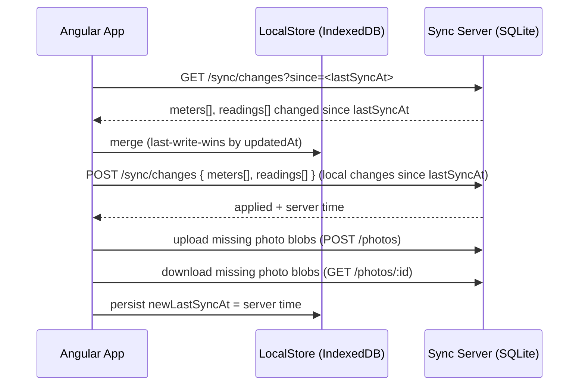

# Phase 2 - Sync & Server (PRD 02)

> Read `00-overview.md` and `01-phase-1-mvp-local-app.md` first. This phase builds on the
> completed Phase 1 app without changing its user experience.

## 1. Objective

Add multi-device sync and backup by introducing a self-hosted Node.js + SQLite server and
a sync engine in the Angular app. Data created offline on any device converges to the same
state after syncing, and the server is a reliable backup.

## 2. Scope

### In scope
- Node.js (Express) sync server with SQLite storage.
- Docker + docker-compose deployment.
- REST sync API: pull changes, push changes, upload/download photo blobs.
- Angular sync engine: change tracking, last-write-wins conflict resolution, soft-delete
  propagation, background sync when online, and a sync status indicator.
- Configurable server URL in the app.

### Out of scope
- Authentication (see section 8 - by design, home network only).
- Multi-user accounts, cost tracking, reminders (product non-goals).
- Changing Phase 1 UI/flows beyond adding a sync status indicator and a settings field.

## 3. Server

### 3.1 Tech
- Node.js + Express.
- SQLite (single file, e.g. `/data/meters.db`) via a driver such as `better-sqlite3`.
- Dockerfile + `docker-compose.yml`; the SQLite file lives on a mounted volume so data
  survives container restarts.

### 3.2 Server schema
Mirror the shared data model (`00-overview.md` section 8):
- `meters` (all fields incl. `updatedAt`, `deletedAt`).
- `readings` (all fields incl. `photoId`, `updatedAt`, `deletedAt`).
- `photos` (`id`, `readingId`, `mimeType`, `data` BLOB, `createdAt`).

All timestamps stored as ISO 8601 UTC strings. Ids are the client-generated UUIDs
(the server never generates ids).

### 3.3 Deployment
- `docker-compose up` starts the server on a configurable port (default e.g. 3000).
- Volume mount for the SQLite file.
- Health endpoint `GET /health` returns 200.
- README documents how to run it on a home server and how to point devices at it.

## 4. Sync model

- **Identity**: UUIDs are generated client-side, so records created on different devices
  never collide and merge naturally.
- **Change detection**: each record's `updatedAt` (ISO 8601) marks its last change.
- **Conflict resolution**: **last-write-wins** by `updatedAt`. If two devices edited the
  same record, the one with the greater `updatedAt` wins the whole record.
- **Deletes**: soft deletes (`deletedAt` set, `updatedAt` bumped) propagate like any edit.
- **Photos**: `PhotoBlob` is immutable; sync transfers blobs that the peer is missing,
  keyed by id.

### 4.1 Sync flow



Notes:
- The app tracks a `lastSyncAt` cursor (per server URL) in IndexedDB.
- Push sends all local records with `updatedAt > lastSyncAt`.
- Pull requests all server records with `updatedAt > lastSyncAt`.
- Merge is idempotent; running sync twice is a no-op if nothing changed.

## 5. REST API contract

Base URL configurable in the app. All JSON unless noted.

### `GET /health`
- 200 `{ "status": "ok", "time": "<ISO>" }`

### `GET /sync/changes?since=<ISO or empty>`
- Returns records changed strictly after `since` (or all if empty).
- 200:
```json
{
  "serverTime": "2026-07-31T15:00:00.000Z",
  "meters": [ { "id": "...", "name": "...", "type": "electricity", "unit": "kWh", "location": "...", "serialNumber": "...", "notes": "...", "createdAt": "...", "updatedAt": "...", "deletedAt": null } ],
  "readings": [ { "id": "...", "meterId": "...", "value": 14523, "readAt": "...", "note": "...", "photoId": null, "createdAt": "...", "updatedAt": "...", "deletedAt": null } ]
}
```

### `POST /sync/changes`
- Body: `{ "meters": [...], "readings": [...] }` (records with local changes).
- Server upserts each record using last-write-wins by `updatedAt` (incoming applied only
  if its `updatedAt` >= stored `updatedAt`).
- 200:
```json
{ "serverTime": "2026-07-31T15:00:05.000Z", "applied": { "meters": 2, "readings": 5 } }
```

### `GET /photos/:id`
- Returns the photo binary with correct `Content-Type` (from stored `mimeType`).
- 404 if unknown.

### `POST /photos`
- Body: photo metadata + binary (e.g. multipart or JSON with base64: choose one and
  document it; multipart recommended for large images).
- Fields: `id`, `readingId`, `mimeType`, and the binary data.
- Idempotent: posting an existing `id` is a no-op success.
- 200 `{ "id": "..." }`

### `GET /photos/manifest?since=<ISO>`
- Optional helper: returns `{ "ids": ["..."] }` of photo ids the server has, so the app
  can determine which blobs to upload/download. Alternatively derive from readings'
  `photoId`; document whichever approach is implemented.

## 6. Angular sync engine

- New `SyncService` that depends only on `LocalStore` (from Phase 1) and an HTTP client.
- Responsibilities:
  - Read/write the `lastSyncAt` cursor (per configured server URL).
  - Pull, merge (last-write-wins), push, and reconcile photo blobs.
  - Detect connectivity (`navigator.onLine` + fetch failure handling) and trigger
    background sync when the app comes online and periodically while online.
  - Expose reactive sync status via Signals: `idle | syncing | offline | error` plus
    `lastSyncAt`.
- **No changes to Phase 1 data flows**: components keep reading/writing through `LocalStore`;
  sync happens in the background.

### 6.1 UI additions
- A small **sync status indicator** (e.g. in the header) showing current status and last
  sync time, with a manual "Sync now" action.
- A **settings** field to set the server URL (persisted locally). Empty URL = sync disabled
  (app behaves exactly like Phase 1).

## 7. Acceptance criteria

- [ ] With the server running, two browsers pointed at the same server converge to identical
      meter/reading data after syncing (created, edited, and deleted records all propagate).
- [ ] Editing the same record on two devices resolves to the one with the later `updatedAt`.
- [ ] Soft deletes propagate and the record disappears from all views on both devices.
- [ ] Photos captured offline on device A appear on device B after sync.
- [ ] Sync is idempotent (running it repeatedly changes nothing when data is unchanged).
- [ ] Server data survives a container restart (volume-persisted SQLite).
- [ ] `docker-compose up` brings the server up; `GET /health` returns 200.
- [ ] With no server URL configured, the app works exactly as in Phase 1 (fully offline).

## 8. Security note (important)

By explicit decision, the server has **no authentication** and is intended to run only on
the user's private/home network. Do not expose it directly to the public internet.

If public exposure is ever needed, add one of the following before doing so (documented as
a placeholder, not implemented in this phase):
- A pre-shared API token/header required on every request, or
- A single-password login issuing a session token,
- and serve over HTTPS (e.g. behind a reverse proxy).

The API and sync engine should be structured so a single auth header can be added later
without reworking the sync logic.

## 9. Definition of Done (Phase 2)

- [ ] Server implemented with the API in section 5, Dockerized with a persistent volume.
- [ ] `SyncService` implemented with last-write-wins, soft-delete propagation, photo sync,
      background + manual sync, and status Signals.
- [ ] Sync status indicator and server-URL setting added to the UI.
- [ ] All acceptance criteria in section 7 pass.
- [ ] README covers running the server (Docker) and configuring devices, plus the security note.
